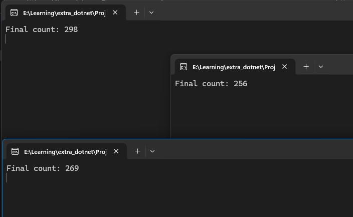
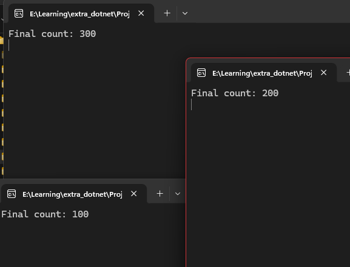

# 🚀 .NET Concurrency & Threading

C# and .NET 9+ concurrency learning repository.

---

## 💻 Sections Overview

### 1. Process vs. Thread (`ProcessThread`)

- **Focus**: OS process isolation vs shared thread memory, thread priority settings, and CPU execution scheduling.

### 2. Race Conditions (`RaceCondition`)

- **Focus**: State corruption pitfalls and why arithmetic updates like `x++` are not atomic at CPU level.

### 3. Resolving Race Conditions (`RaceConditionResolveByLock`)

- **Focus**: Establishing mutual exclusion using the optimized **.NET 9 `System.Threading.Lock`** object.

### 4. Parallel Divide & Conquer (`ThreadDivideAndConquer`)

- **Focus**: Multi-threaded workload partitioning, lock-free parallel summing via local arrays, and thread scheduling overhead.

### 5. Thread-Safe Background Workers (`ThreadWebServer`)

- **Focus**: Producer-Consumer pattern using background daemon threads (`IsBackground = true`) and `ConcurrentQueue<T>`.

### 6. Airplane Booking Inventory Simulation (`AirPlaneBookingSimulation`)

- **Focus**: Preventing high-concurrency booking inventory overselling via critical section locks.

### 7. Advanced Lock Timeouts (`AirPlaneBookingSimulationUsingMonitor`)

- **Focus**: Non-blocking lock attempts and load shedding using `Monitor.TryEnter` with timeouts.

### 8. Cross-Process Mutex (`SynchronizaProcessUsingMutex`)

- **Focus**: Utilizing named global system Mutexes (`Global\countMutex`) to safe-guard shared files across multiple executing OS processes.

### 8. ParallelsIterations (`ParallelsIteration`)

- **Focus**: Using Parallelism on Invoke/For/ForEach

---

## 🎨 Process Mutex Visualization

#### ❌ Without Mutex (Race Condition Across 4 Processes)

Overlapping writes corrupt file data, resulting in lost updates:


#### With Mutex (Perfect Cross-Process Synchronization)

The OS Named Mutex serializes access, yielding a perfectly correct final count:


---

## 🏎️ Concurrency Primitives comparison

| Primitive                | Scope          | Mechanism                      | Best Used For                                                         |
| :----------------------- | :------------- | :----------------------------- | :-------------------------------------------------------------------- |
| **`lock (obj)`**         | Single Process | Compiler-assisted `Lock` scope | Protecting in-memory critical sections.                               |
| **`Monitor`**            | Single Process | Explicit lock/timeouts         | Advanced scenarios requiring lock timeouts (`TryEnter`) or signaling. |
| **`Mutex`**              | Cross-Process  | OS Named Kernel Object         | Protecting shared files/resources across different running programs.  |
| **`ConcurrentQueue<T>`** | Single Process | Lock-free comparison           | Safe, high-performance Producer-Consumer pipelines.                   |
| **Local Sum Array**      | Single Process | Partitioned memory slots       | Pure lock-free parallel divide-and-conquer computations.              |

---

## 🛠️ How to Build and Run

```bash
# Run any section:
dotnet run --project ProcessThread
dotnet run --project RaceCondition
dotnet run --project RaceConditionResolveByLock
dotnet run --project ThreadDivideAndConquer
dotnet run --project ThreadWebServer
dotnet run --project AirPlaneBookingSimulation
dotnet run --project AirPlaneBookingSimulationUsingMonitor
dotnet run --project SynchronizaProcessUsingMutex
dotnet run --project Parallelism/ParallelsIteration.csproj
```
